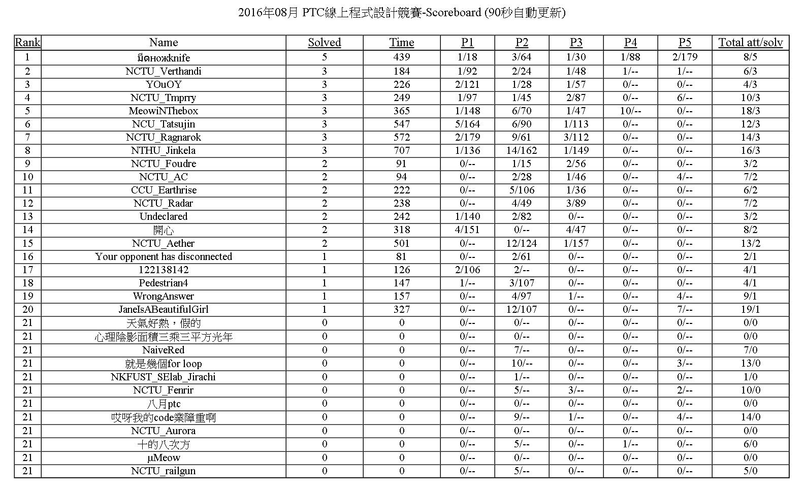

# PTC (2016/08/10)

## 1
提敘:
	給你個個整數 n (1<=n<=20) 問你 sigma(i^k) (i from 1 to n)
題解:
	本地建表
	或是
	設未知數 a0 a1 a2 a3...ak
	使得 a0*i^0 + a1*i^1 +.....+ an*i^k = sigma i^k
	帶入 k+1個數字
	最後 高斯消去法解未知數

## 2
提敘:
	你有 Mo 個 'O' 和 Mx 個 'X' ,要用這些字元組成一個字串，且滿足 'O' 不能連續出現 Co 次，'X' 不能連續出現 Cx 次。
	問可以組成的字串的長度的最大值。
題解:
	先把 'O', 'X' 交錯排列，可以把較少的那個用完，再來看還沒用完的最多可以放幾個。
	注意 Co, Cx 為 0 的狀況。
	
## 3
題敘:
	給一個字串 s，每次操作可以將任何一個字元改成別的字元或刪除或新增一個字元，求使得最後字串是回文的最少操作次數。
題解:
	首先可以觀察到插入動作和刪除動作是等價的，我們可以忽略插入的操作。於是可以使用 DP 作狀態轉移：DP 轉移式: dp(l, r) 表示使得 s[1:l] 和 s[r:n] 是回文的最少操作次數。

注意邊界處理問題。

## result

